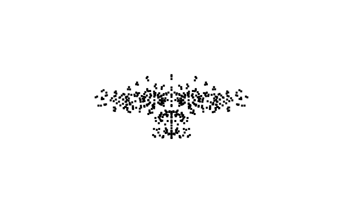

# JSRenderer
Trying to learn javascript by implementing a .OBJ renderer

##### Vertices displayed as dots in first perspective view
<kbd>
  
</kbd>

##### Vertices displayed as dots in first orthographic view
<kbd>
  
</kbd>

##### Vertices displayed as dots in almost a correct way
<kbd>
  
</kbd>
