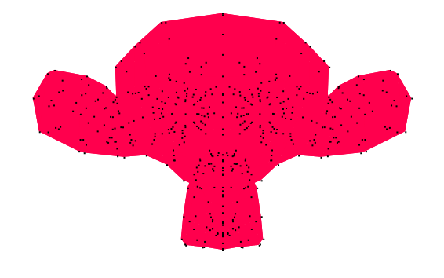

# JSRenderer

## Trying to learn javascript by implementing a .OBJ renderer

### First try adding faces

<kbd>
  
</kbd>

#### Adding unit tests on the projection matrices makes a difference

| Projection  | Before                                    | After                                     |
| ----------- | ----------------------------------------- | ----------------------------------------- |
| Perspective |  |  |
| Ortographic |  |  |

##### First render, vertices displayed as dots in a way

<kbd>
  
</kbd>
